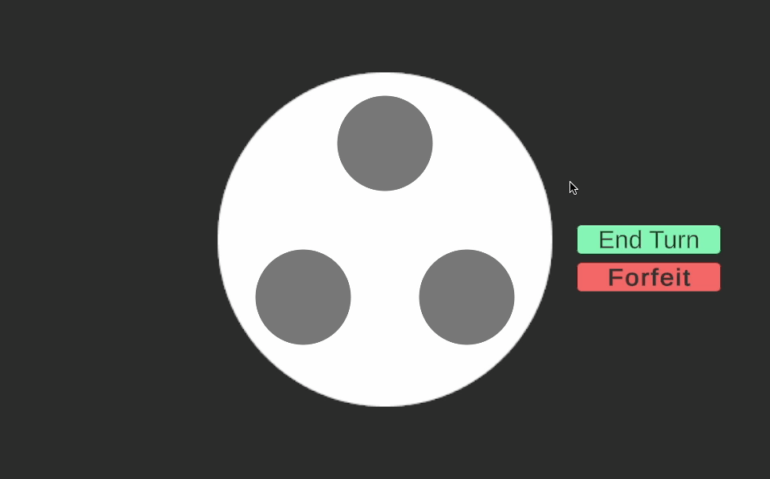

# Rotating Table
This is a Unity game developed to accompany the Rotating Table problem, and used for enrichment activities in Mathematics summer camps held by Queen’s University.

**Web Link:** https://j15a.github.io/rotating-table/

**Technologies Used:** Unity, C#, WebGL

## The Problem
A circular table has $n$ pads, spaced around its perimeter, and each covered by an opaque grey screen. Beneath the screens, each pad is either red or blue. Every turn, the table rotates rapidly, making it impossible to track the pads' new postions.

You have $m$ hands. Each turn, you may place each of your hands on one of the pads. Then, the screen will open, and you will see the colour of the pad, and you may choose to switch the colour of one or both of the pads. You win when all the pads on the table are the same colour. Can you **guarantee** a win? If so, find a sequence of moves that will guarantee a win **regardless** of how the table rotates.

## The Game
In this game, instead of random rotations, after you have made a move, an adversarial robot rotates the table. This robot is very clever, and will always rotate the table such that you cannot win unless you have executed a strategy that **guarantees** a win. This way, you can test your strategies by playing against the robot.

Additionally, in the game you may customize the number of pads on the table and the number of hands you have, to explore variations of the problem. Some of these variations have an easy guaranteed solution, others have no solution. Use the simulator along with your mathematical reasoning skills to figure out which variations have solutions, and what those solutions look like. Finally, try to find the solutions which take the least number of turns, or find patterns to see what values of $n$ and $m$ work in general.

### How to play
1. Select $m$ pads to reveal
2. Toggle their colours
3. Press "End Turn"
4. Let the table spin
5. Repeat until you find the solution, or determine if there is none

### Controls
Keyboard shortcuts:
* Number $i$ on your keyboard will select/toggle the $i$ᵗʰ pad
* Enter to end turn
